# Diagramas PlantUML – Sistema de Gestión de Tareas EPO

> Copia cada bloque en [https://www.plantuml.com/plantuml/uml/](https://www.plantuml.com/plantuml/uml/) o en la extensión PlantUML de VS Code.

---

## Figura 3 – Diagrama de Casos de Uso General

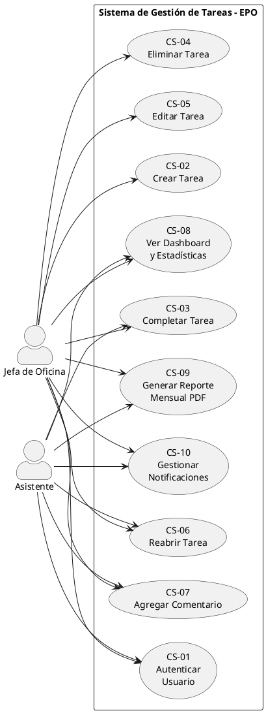

---

## Figura 4 – CS-01: Autenticar Usuario

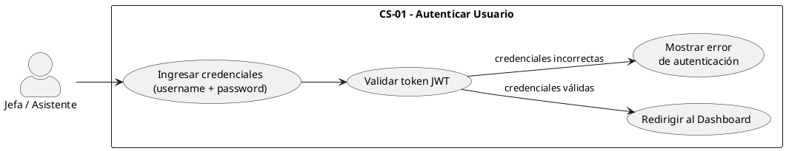

---

## Figura 5 – CS-02: Crear Tarea

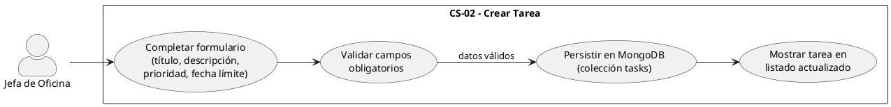

---

## Figura 6 – CS-03: Completar Tarea

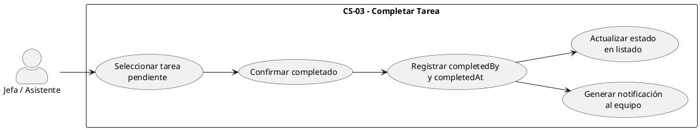

---

## Figura 7 – CS-04: Eliminar Tarea

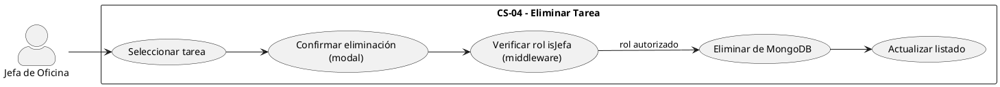

---

## Figura 8 – CS-05: Editar Tarea

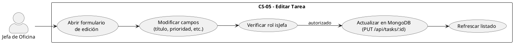

---

## Figura 9 – CS-06: Reabrir Tarea

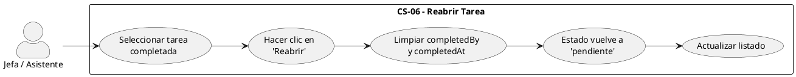

---

## Figura 10 – CS-07: Agregar Comentario a Tarea

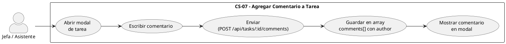

---

## Figura 11 – CS-08: Ver Dashboard y Estadísticas

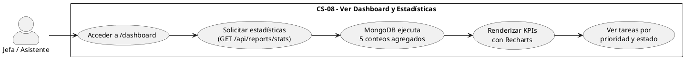

---

## Figura 12 – CS-09: Generar Reporte Mensual en PDF

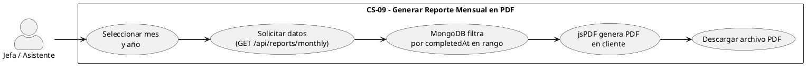

---

## Figura 13 – CS-10: Gestionar Notificaciones

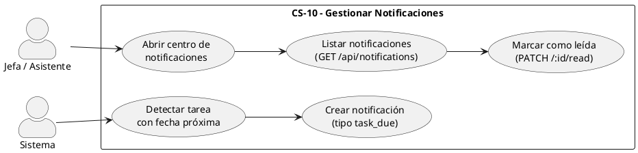

---

## DS CS-01 – Diagrama de Secuencia: Autenticar Usuario

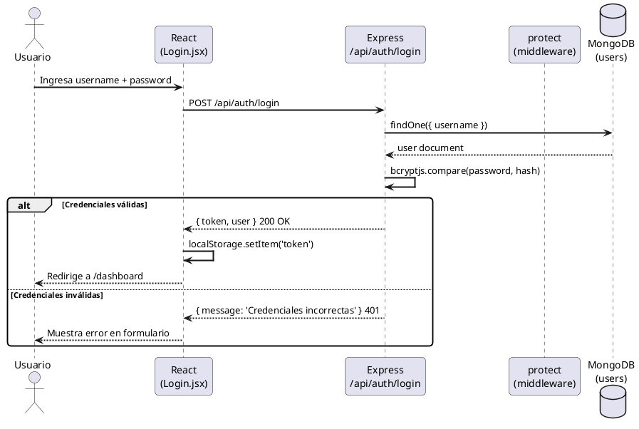

---

## DS CS-02 – Diagrama de Secuencia: Crear Tarea

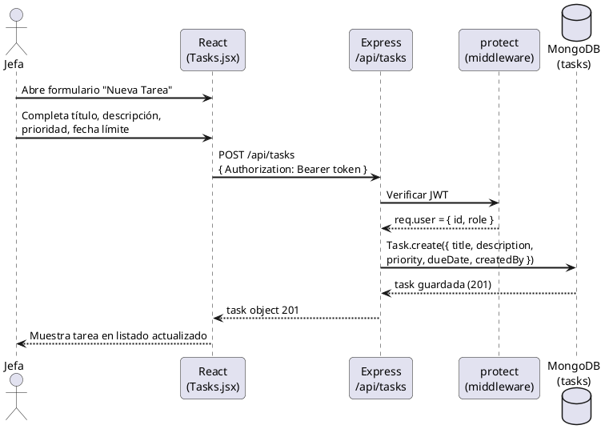

---

## DS CS-03 – Diagrama de Secuencia: Completar Tarea

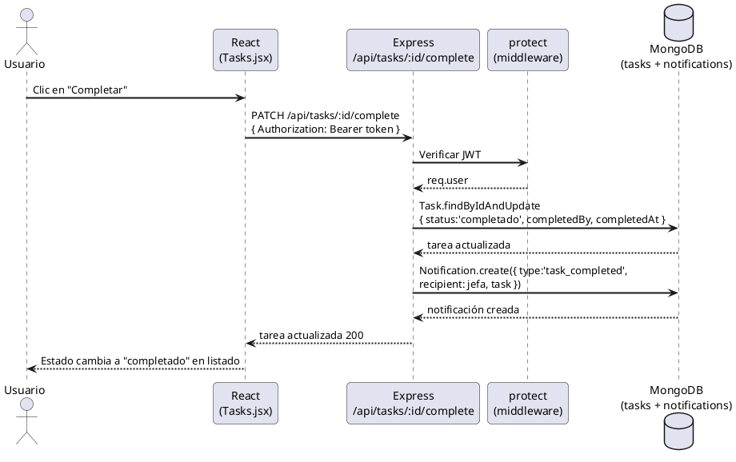

---

## DS CS-04 – Diagrama de Secuencia: Eliminar Tarea

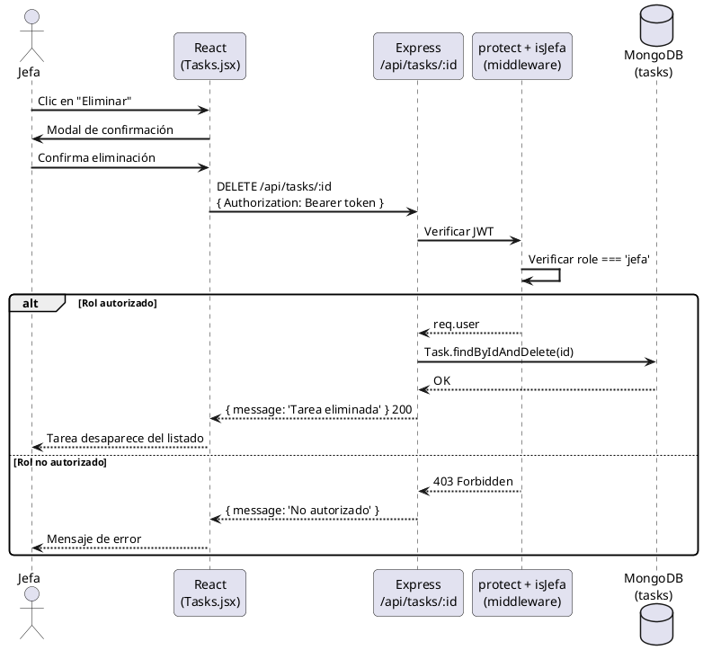

---

## DS CS-05 – Diagrama de Secuencia: Editar Tarea

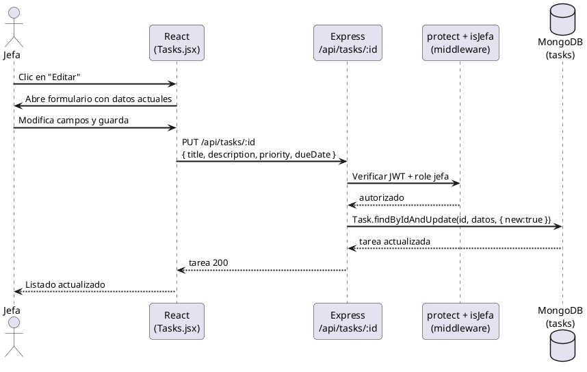

---

## DS CS-06 – Diagrama de Secuencia: Reabrir Tarea

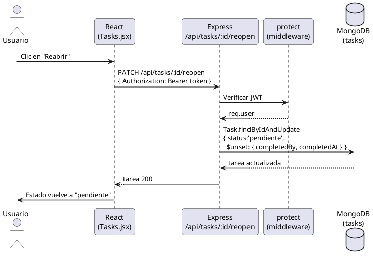

---

## DS CS-07 – Diagrama de Secuencia: Agregar Comentario

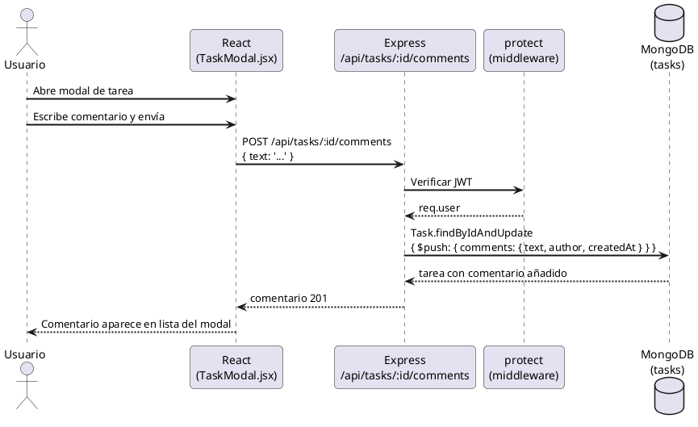

---

## DS CS-08 – Diagrama de Secuencia: Ver Dashboard

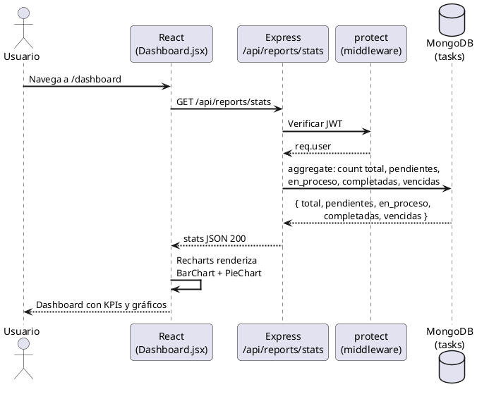

---

## DS CS-09 – Diagrama de Secuencia: Generar Reporte PDF

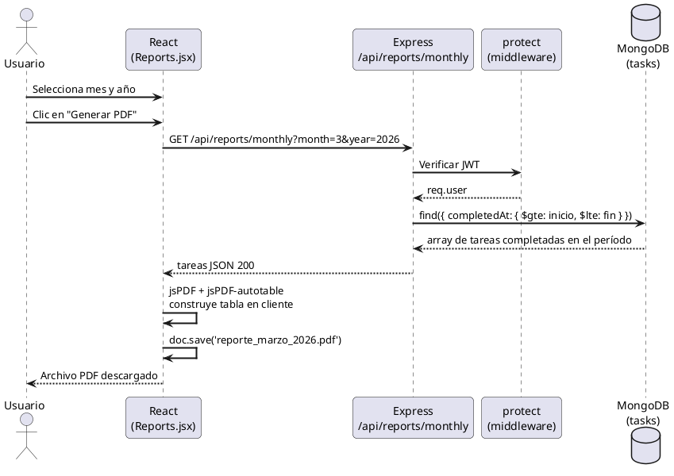

---

## DS CS-10 – Diagrama de Secuencia: Gestionar Notificaciones

```plantuml
@startuml
skinparam sequenceArrowThickness 2
skinparam roundcorner 10

actor "Usuario" as U
participant "React\n(NotificationsCenter.jsx)" as R
participant "Express\n/api/notifications" as E
participant "protect\n(middleware)" as M
database "MongoDB\n(notifications)" as DB

note over DB : Cron/check ejecutado\npreviamente crea\nnotification task_due

U  -> R  : Abre centro de notificaciones
R  -> E  : GET /api/notifications
E  -> M  : Verificar JWT
M --> E  : req.user
E  -> DB : find({ recipient: req.user.id })\n.populate('task')
DB --> E : array de notificaciones
E  --> R  : notificaciones JSON 200
R  --> U  : Lista de notificaciones con badge
U  -> R  : Clic en notificación
R  -> E  : PATCH /api/notifications/:id/read
E  -> DB : findByIdAndUpdate({ isRead: true })
DB --> E : OK
E  --> R  : 200
R  --> U  : Badge decrementado, ítem marcado
@enduml
```

---

## Figura 24 – Diagrama de Base de Datos

```plantuml
@startuml
skinparam componentStyle rectangle
skinparam roundcorner 8

entity "users" as U {
  * _id : ObjectId <<PK>>
  --
  * username   : String (único)
  * password   : String (bcryptjs hash)
  * role       : String (jefa | asistente)
  * fullName   : String
    createdAt  : Date
    updatedAt  : Date
}

entity "tasks" as T {
  * _id         : ObjectId <<PK>>
  --
  * title       : String
    description : String
  * priority    : String (alta | media | baja)
  * status      : String (pendiente | en_proceso | completado)
    dueDate     : Date
    createdBy   : ObjectId <<FK users>>
    completedBy : ObjectId <<FK users>>
    completedAt : Date
    comments    : Array<Comment>
    createdAt   : Date
    updatedAt   : Date
}

entity "Comment" as C {
  * text      : String
  * author    : ObjectId <<FK users>>
  * createdAt : Date
}

entity "notifications" as N {
  * _id       : ObjectId <<PK>>
  --
  * recipient : ObjectId <<FK users>>
  * sender    : ObjectId <<FK users>>
  * type      : String (task_due | task_completed | task_assigned)
  * message   : String
    task      : ObjectId <<FK tasks>>
  * isRead    : Boolean (default: false)
    createdAt : Date
}

U ||--o{ T : "crea (createdBy)"
U ||--o{ T : "completa (completedBy)"
T ||--o{ C : "tiene comentarios"
U ||--o{ N : "recibe (recipient)"
U ||--o{ N : "envía (sender)"
T ||--o{ N : "referenciada en"
@enduml
```

---

## Figura 25 – Diagrama de Componentes

```plantuml
@startuml
skinparam componentStyle rectangle
skinparam roundcorner 10

package "Frontend – React 18 + Vite" {
  [AuthContext]       as AC
  [ToastContext]      as TC
  [Login.jsx]         as LOGIN
  [Dashboard.jsx]     as DASH
  [Tasks.jsx]         as TASKS
  [TaskModal.jsx]     as MODAL
  [Reports.jsx]       as REP
  [Stats.jsx]         as STATS
  [NotificationsCenter.jsx] as NOTIF
  [Profile.jsx]       as PROF
  [PrivateRoute]      as PR

  LOGIN   --> AC    : setUser / token
  PR      --> AC    : verifica auth
  DASH    --> AC
  TASKS   --> MODAL : abre
  STATS   --> TC    : toast feedback
}

package "API Client" {
  [Axios Instance\n(baseURL + JWT header)] as AX
}

package "Backend – Node.js / Express" {
  [authRoutes\n/api/auth]         as AR
  [taskRoutes\n/api/tasks]        as TR
  [reportRoutes\n/api/reports]    as RR
  [notifRoutes\n/api/notifications] as NR

  [protect\n(verifyToken)]        as MW1
  [isJefa\n(roleCheck)]           as MW2

  [authController]    as AC2
  [taskController]    as TC2
  [reportController]  as RC2
  [notifController]   as NC2
}

package "Modelos Mongoose" {
  [User.js]           as MU
  [Task.js]           as MT
  [Notification.js]   as MN
}

database "MongoDB Atlas\n(Plan M0)" as MONGO {
  [users]
  [tasks]
  [notifications]
}

' Conexiones frontend → API
DASH    --> AX : GET /api/reports/stats
TASKS   --> AX : GET/POST/PUT/DELETE /api/tasks
REP     --> AX : GET /api/reports/monthly
NOTIF   --> AX : GET/PATCH /api/notifications
LOGIN   --> AX : POST /api/auth/login

' API → Routes
AX --> AR
AX --> TR
AX --> RR
AX --> NR

' Middleware
AR --> MW1
TR --> MW1
TR --> MW2
RR --> MW1
NR --> MW1

' Routes → Controllers
AR --> AC2
TR --> TC2
RR --> RC2
NR --> NC2

' Controllers → Models
AC2 --> MU
TC2 --> MT
TC2 --> MN
RC2 --> MT
NC2 --> MN

' Models → DB
MU --> MONGO
MT --> MONGO
MN --> MONGO
@enduml
```

---

## Figura 26 – Diagrama de Despliegue

```plantuml
@startuml
skinparam nodeStyle rectangle
skinparam roundcorner 10

node "Vercel\n(CDN Global)" as VERCEL {
  artifact "Frontend\nReact 18 + Vite\n(build estático)" as FE
}

node "Render\n(Free Tier – Oregon)" as RENDER {
  artifact "Backend\nNode.js 18 / Express\n(puerto 10000)" as BE
}

node "MongoDB Atlas\n(Cluster M0 – us-east)" as ATLAS {
  database "Cluster0\n3 colecciones\n(users, tasks, notifications)" as DB
}

node "Navegador\n(Chrome / Edge / Firefox)" as BROWSER {
  component "App React\n(SPA)" as SPA
}

BROWSER --> VERCEL   : HTTPS (petición inicial)
VERCEL  --> BROWSER  : index.html + chunks JS
BROWSER --> RENDER   : HTTPS + JWT\n(llamadas API REST)
RENDER  --> ATLAS    : TLS / mongoose\n(MONGODB_URI)
@enduml
```

---

## Figura 27 – Diagrama de Clases

```plantuml
@startuml
skinparam classAttributeIconSize 0
skinparam roundcorner 10

class User {
  - _id       : ObjectId
  - username  : String
  - password  : String
  - role      : String
  - fullName  : String
  --
  + comparePassword(plain) : Boolean
}

class Task {
  - _id         : ObjectId
  - title       : String
  - description : String
  - priority    : String
  - status      : String
  - dueDate     : Date
  - createdBy   : ObjectId
  - completedBy : ObjectId
  - completedAt : Date
  - comments    : Comment[]
  --
  + markComplete(userId) : void
  + reopen() : void
  + addComment(text, userId) : void
}

class Comment {
  - text      : String
  - author    : ObjectId
  - createdAt : Date
}

class Notification {
  - _id       : ObjectId
  - recipient : ObjectId
  - sender    : ObjectId
  - type      : String
  - message   : String
  - task      : ObjectId
  - isRead    : Boolean
  --
  + markRead() : void
}

class AuthController {
  + login(req, res) : void
  + getMe(req, res) : void
}

class TaskController {
  + getTasks(req, res) : void
  + createTask(req, res) : void
  + updateTask(req, res) : void
  + deleteTask(req, res) : void
  + completeTask(req, res) : void
  + reopenTask(req, res) : void
  + addComment(req, res) : void
}

class ReportController {
  + getStats(req, res) : void
  + getMonthlyReport(req, res) : void
}

class NotificationController {
  + getNotifications(req, res) : void
  + markAsRead(req, res) : void
}

class protect <<middleware>> {
  + verifyToken(req, res, next) : void
}

class isJefa <<middleware>> {
  + checkRole(req, res, next) : void
}

AuthController     --> User             : findOne / comparePassword
TaskController     --> Task             : CRUD
TaskController     --> Notification     : create
ReportController   --> Task             : aggregate / find
NotificationController --> Notification : find / update
protect            --> User             : jwt.verify → findById
isJefa             --> User             : req.user.role
Task               *-- Comment          : embeds
@enduml
```

---

> **Nota.** Todos los diagramas son de elaboración propia basados en el código fuente del repositorio del Sistema de Gestión de Tareas – Oficina EPO (UPT), desarrollado con stack MERN (MongoDB Atlas · Express · React 18 · Node.js).
